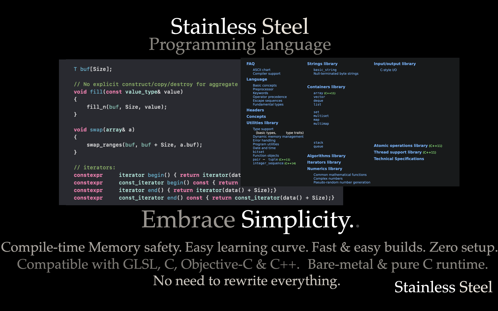
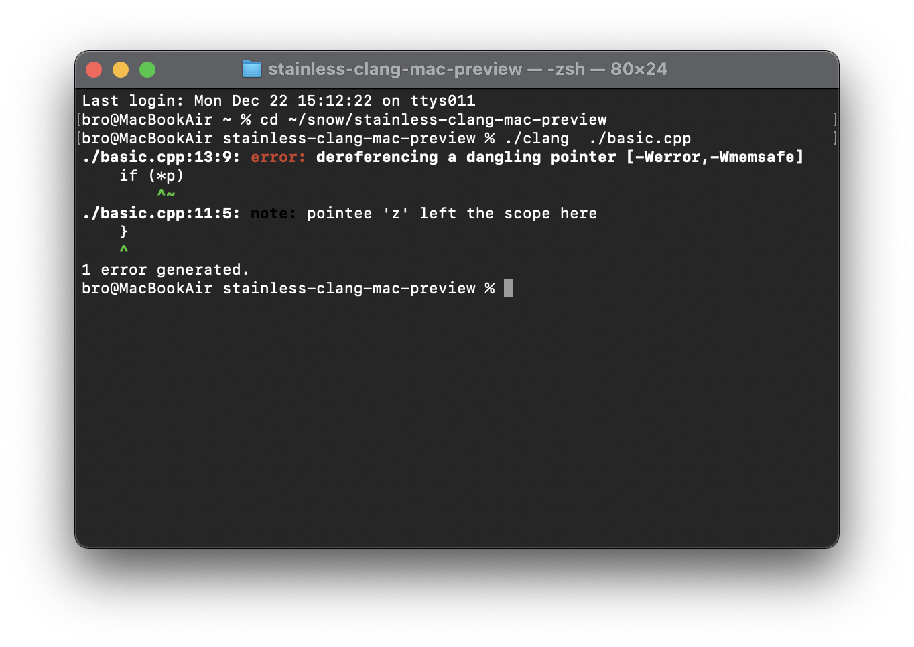
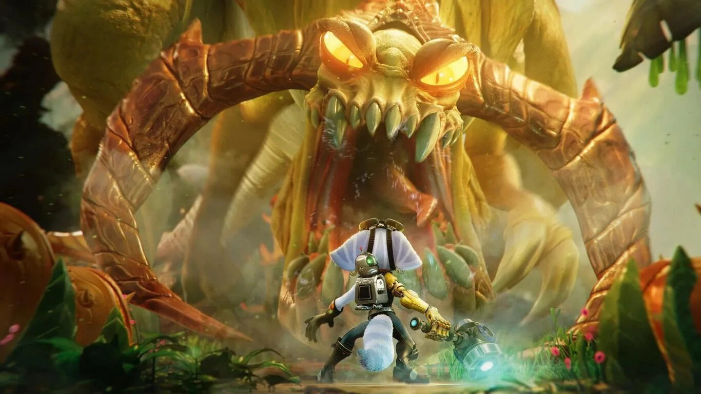

# Stainless Steel - The most insane Systems language

 


## Frutiger Aero (Future)

Imagine a world where you buy things once, and own them forever.

What happens when your computer stays secure, and is supported for the next 15 years without needing to update?

What happens when we remove Planned obsolescence, and make technology built to last?

Imagine a world where your web browser, games, and technology just keep working, and vintage tech is honored! 
A highly educated future where - from middle school through college - everyone learns to maintain, repair, & create technology ourselves.

What if we made technology that shows you how to repair it, without connecting to the internet?

What if we learned to **OWN** things, **<u>FOREVER</u>**.

## Welcome to Stainless Steel


---

The Stainless Steel programming language is based on

- **Frutiger Aero** ( [What REALLY Happened to Frutiger Aero? - YouTube](https://www.youtube.com/watch?v=jnDALSLlXGM) ),

- The **"Clippy" Consumer Rights** movement ([Change your profile picture to clippy. I'm serious - YouTube](https://www.youtube.com/watch?v=2_Dtmpe9qaQ) ) ([Draft:Clippy Campaign - Wikipedia](https://en.wikipedia.org/wiki/Draft:Clippy_Campaign?useskin=vector) ),

- and the **Gen Z revolution** [Straw Hat Pirates' Jolly Roger - Wikipedia](https://en.wikipedia.org/wiki/Straw_Hat_Pirates%27_Jolly_Roger?useskin=vector)

---

📎🖇We love owning things forever.


## Download Preview

- [Mac - supports every Mac since Snow Leopard (2010 to 2025)](https://github.com/Peach1/Stainless/releases/tag/mac-preview-dec-22-2025)

- Windows - coming soon. (Windows XP to Windows 10 or later)

- Linux - coming soon

- **Archive.org** mirror - https://web.archive.org/web/20251223003727/https://github.com/Peach1/Stainless

The preview includes the Stainless-clang compiler; Designed to be a drop-in replacement for clang and gcc. Major features include memory safety inference, reflection with sane syntax, and compile-time static_print. It's yours to use forever.

The **Mac** version is an important proof of concept - The same binary works on all Macs released the **past 15 years** - 2010 to 2025. **goodbye Planned Obsolescence**

Chatrooms:

- Discord: https://discord.gg/W4zHjtjDac

(We plan to make our own self-hosted Discord alternative eventually)
---

The Stainless 3D graphics and video game toolkit is coming soon.

The full release of Stainless will include `snowbuild` and `snowman` our build system & package manager for Stainless and C++.

We are also preparing to launch a first-class IDE with documentation that hyperlinks C and C++ codebases together across projects, so all dependencies can be quickly reviewed & analyzed offline. We're boosting the end-user's **informed consent** by letting the computer itself show you exactly how it works - Stainless is taking **View source**  from the web browser and bringing it back to **native desktop applications**, showing you the original C, C++, and Stainless code. We promote informed consent with easily-buildable, deterministic, precisely reproducible source code, with freedom much like the days of the early 2000s wild west internet.

## Stainless is Humanity-First

Stainless is a **humanity-first**, <u>family-owned</u> technology toolchain that lets you own everything. It's a systems language that lets experts and kids be brilliant naturally. Understand how everything works, explore the depths of computer hardware & software - from the low-level to the highest level. Stainless preserves the historical record of computer science and gives everyone access to authentic buildable source code for games, scientific experiments, and culturally significant software written from the 1990s to 2025 and beyond.

Stainless is made for beginners, enthusiasts, and industry experts to master art, science, & technology, and to rekindle our original love for humanity & creativity.


## Features of Stainless Steel

- **Low-friction** - Stainless is source-compatible with C, C++, and Objective C.

- **Memory-safety inference** - Detect errors at compile time, so you can have more fun time. No annotation required. (`-Werror=memsafe` on by default)

- **Cross-platform & easy to build** - The compiler, libraries, and headers exist in one folder - `snow`, so you can put it on a USB stick. No globals, no environment variables, no configuration. We studied how to make 1 portable compiler that builds for all the known computer systems on the planet.

- **Family-owned** - Stainless lets you own technology forever so you can give tech to your sons and grandsons. So parents and teachers can audit source code changelogs; So fathers and sons can check if technology is ethical for their friends and family. Stainless encourages a world with software & hardware built to last. Enhance your technological wealth with software that never goes out of date.

- **Pro Consumer rights** - True informed consent happens with source code, literacy, and critical commentary. Stainless is designed to make it easy for a layman to become an expert and master technology. We are effectively going through key systems software from the past 3 decades, and hyperlinking it all together.

- **No artificial additives** - Designed and hand-crafted by actual real live people. We think for ourselves, we reject corporate dependency, and enjoy the process of the work.

- **Fully self-hosted** - all our dependencies, asm generators, backends, we own it. Stainless depends on less, so you can enjoy life more.

- **Zero-dependency build system** - No CMake, no shellscripts, no problem. We made a secure build system that does not connect to the internet, and does not require scripts or foreign languages. We call it `snowbuild`... Do you wanna build a program? 

- **No Bindings** It's a Stainless policy that all code be first-class, either something is written in Stainless, C, or C++, and that's it - Stainless is a full-ownership native language where we don't do any intermediate layers.

- **NO TELEMETRY** - Unlike LLVM, Stainless has ZERO telemetry - that means Stainless has full offline privacy with no backdoors. This is strictly enforced. We use our own assembly backend and explicitly reject LLVM 20 since it added a spyware telemetry backdoor  [[llvm]Add a simple Telemetry framework (#102323) · llvm/llvm-project@8c00900 · GitHub](https://github.com/llvm/llvm-project/commit/8c0090030bf89df7e0dbe5827a83d52627b2c87f)

- **Less is more** - We started with baremetal C++14, removed features, then added fun extras like reflection (with saner syntax), and memory-safety inference.

- **Lightweight** - Stainless only needs a plain C99 runtime (or no runtime at all) - this makes Stainless run on basically every major platform. We also optimized our standard library to produce minimal assembly - even when the optimizer is turned off - so you get high level C++ features, but with a simpler syntax and faster assembly generation by default.

- **Baremetal** -  [We cleaned up the runtime](https://arobenko.github.io/bare_metal_cpp/#compiler_output-nostdlib) and Stainless Steel is **baremetal by default.** `-fno-exceptions` `-fno-rtti` `-nostdinc++`

- **Easy to pickup, not-so-hard to master** - The Stainless language is designed so the layman can easily become an expert.

- **Implements scientific research** - From Pixar, to the video games industry, and beyond! [Luxray pathtracer coming soon]

- **Shaders built-in** - You can literally run shadertoy GLSL on the CPU with Stainless - The Stainless language is natively compatible with a large subset of GLSL, making it easy to inspect and share code between the CPU & GPU - No need to rewrite everything.

- **Easy archiving** - Stainless can be downloaded once and used offline forever (easy archiving)

- **Multi-lingual Systems literacy** - Stainless lets you access the native system's language by default, we're basically C & C++ in 1 language, but fancier.

- **C++14 4ever** - We made a simpler, more cross-platform, faster-to-compile, Long Term Support version of C++ that keeps the language stable, and realistic for an individual to master. We believe baremetal C++14 will remain the most widely used version of C++ in the future; and the C++20 to 29 series will fall out of use due to its slow compile times and difficult syntax compared to C++14. Stainless provides a reflection syntax usable in C++14 or later, and 3x faster compile times compared to C++26. 

- Designed with a **less is more** philosophy

## Examples

For more advanced examples, see: Peach1/examples

### Memory Safety Inference




Works with the original C and C++ code without having to rewrite everything.

Stainless **memsafe** (which is an error by default)

(use `-Wmemsafe` to turn into a warning)

The following is caught at compile-time:

- struct/class Container invalidation

- Dangling raw pointer

- Modifying a container while looping over it

- Returning data of destroyed container .c_str() or .data()

More safety inference is on the roadmap:

`-Wmemsafe-thread`

`-Wmemsafe-null`

```c
#include <print.h>
#include <defer.h>

int main()
{
    defer { print("unsign it maybe"); };

    print("Hey, I just met you");
    show/ "and this is", String("crazy!");
    let x = -1;
    String y = "Here's my integer";
    show/ x,y;
    print(uint32(x));
    /* unsign it maybe */
    return 0;
}
```

### A New language that works in C++14 mode

The crazy part: Stainless is based on our dialect **C++14 4ever** - it works with GCC 8, Clang 3.7, and the Stainless 2025 compiler, in `gnu++14` mode.

While the Stainless compiler innovates, we intentionally keep the system requirements **no more than C++14** - so it remains easy to bootstrap. We want existing systems to get modern tooling and compile-time memory safety, *without* breaking the toolchain, and *without* having to rewrite everything.

## About the developer

I started Stainless in the early 2000s when I was 10. I grew up with the tech industry and made sure to learn how technology worked from a young age. I saw from young that adults were too jaded, and I had to escape the learned helplessness.

[Learned Helplessness - YouTube](https://www.youtube.com/watch?v=gFmFOmprTt0)

I treat C and C++ as more than just tools, they are real immersive languages with stories and sagas. There is a real language acquisition aspect to the culture of C & C++ - they are truly lived-in languages, with many people from diverse times and backgrounds. It's more than just business, there's love.

## C & C++ are here to stay, and we're Upgrading them.

Humanity can unlock Higher Intelligence naturally, when you really love the people behind the language, and when programming is taught as a discipline from young.


Kids have the power to change the world, and we need to invest in humanity more. There is no language humanity has ever made that is "perfect". But when I look at the catalog of C & C++ games, from GameBoy Advance, to Pokemon Colosseum, to Ratchet and Clank PS5 - **all made with C & C++**; I can honestly say C and C++ are perfect enough - they just need a good reboot.



C and C++ are the only language where you can see the journey of a **rocket science game developer** (John Carmack) make *multiple* **commercially successful game engines** *and* open source them. With C & C++ you see a programming language that kickstarted the video games industry at the turn of the century.

You can't get cooler than that, so Stainless promotes literacy & source-compatibility with systems and game engines from the 1990s, early 2000s, to 2025.

## Systems Requirements that are Unchanging

---

- We made 1 language and runtime that is automatically compatible with all computers, to the fullest extent. Cross-compiles by default.

- We support Windows XP to Windows 10.

- We support every Intel Mac since Mac OS X Snow Leopard (2010) and every M series Mac (2020 and later)

- We support more than 10 years of vintage hardware, and will continue to do so

- We designed Stainless to work on today's hardware for the next 15 years.

- Take a guess which language is permanently removed from the toolchain.

---

## Fully Self-Hosted

We host our own git implementation, we built our own command line tools, we own the compiler, the Stainless language, and asm code generator `Voltro` - specifically so modern and vintage tech never goes out of style.

Self-hosting is what allows Stainless to run on 15 years of hardware and software.

We plan to make the language work on even more vintage hardware, we've gotten requests to add support for the Gameboy and PowerPC, and we're working on it.

## A world where technology doesn't devalue

We grew up with these devices, we built memories and watched movies with our families on these devices.

While other languages, for the sake of money, leave things behind, Stainless is different.

Stainless is built on Ohana.


Our hardware and software is here to stay.

## Stainless and The Hawaiian Language

The history of the Hawaiian language taught us to **reject Government-sponsored language change in the name of Safety**

https://www.hawaiianflair.com/blogs/news/the-history-of-hawaiian-language-suppression-and-revival

In 1893, the American **Committee of Safety** led an <u>illegal overthrow</u> of the Hawaiian kingdom and whipped the native Hawaiians, to prevent them from speaking their native Hawaiian language - not because of "safety", but because the ruling class wanted control.

The American government wants to kill the C programming language for the same reasons the feds tried to kill the Hawaiian language - The ruling class did not want the native islanders to organize a rebellion against the self-appointed American rulers.

Big tech does not want the public to know that within every computer is the ability to make a **Universal Systems Language** that works on every hardware and operating system on the planet - a systems language truly owned by the people. 

We can't change the historical injustice the Hawaiian language suffered from,

but we can absolutely learn from Hawaiian, and protect languages of the future.

## Family-owned language

We want technology family-owned, independently-controlled, and offline-centric.

We want technology easy to repair, easy to reprogram, without needing approval from the manufacturer.

With Stainless, we're making a future of extreme informed consent - Our technology includes scientific research papers, precisely reproducible source code, and fully deterministic results.

I want a toolchain with **no corrosion**, **no telemetry spyware**, and **no corporate meddling**.

I want a humanity-first technology toolchain built to last centuries, a historical reference point that still continues to work just fine into the future.

I want technology owned by us, built for humans, not profit.
I want a **Frutiger Aero** future that actually leads to real hope for the eventual kingdom of heaven.

Stainless Steel: The most insane systems language.
---


## Timeless Technology

We took time-tested standards, C99, C++14, OpenGL ES 3.0, POSIX, HTML/CSS and turned it into 1 fluent, fully-native technology that compiles to native code for all major systems from the past 20 years.

Stainless removes all the unnecessary layers and makes 1 user-friendly language to control your device. No need for bindings, Stainless developers have direct access to the system.

We are source-compatible with 3 existing systems languages. We live alongside 30 years of low-level expertise, while everyday Stainless is faster and easier to use than Java, C#, or Swift.

Stainless is a concise summary of the best parts of the first 25 years of the millennium.

We already support hardware and operating systems from the past 15 years, and plan to extend support forwards and backwards as the Stainless language reaches mass-adoption.

Other languages don't go out of their way to declare specific hardware and operating systems as Supported Forever.

We're crazy enough to declare **Mac OS X Snow Leopard** as a historical treasure we want our grandkids to study & program on. (I'm Gen Z by the way.)

## Why C++14 4ever?

There hasn't been a chance to truly **refine** technology in over a decade. We think it's time to create an easy-to-master C++ that *STAYS* simple, so the majority of the population understands how to create their own technology. The C++ standards committee would never approve of a "C++ final", so we built Stainless Steel. It's an unchanging constant for experts to teach the next generation - It's better for humanity to have one long-term language that works well, changes slowly, and keeps prior expertise relevant for a long time, this is a key feature of natural languages!.

 Systems programming knowledge doesn't have to be restricted to the elite big tech experts anymore. Stainless is built on the most widely understood versions of C and modern C++ that every systems expert on the planet knows. We need 1 systems language where the technology expertise is easily transferred between generations, so we can understand the past - and create an insanely great future.


## Goodbye Planned Obsolescence.

Stainless self-hosts basically everything, we control exactly what goes into our technology. We own all our libraries, we do not depend on a third party package manager, and full self-hosting gives us the power to reject CORROSIVE mandates that try to shoehorn in breaking changes.

---

## Fighting Planned Obsolescence

Dear **corrosive** corporate-controlled languages, we see your plan - to obsolete commonly used standards until the public "owns nothing". You break things on purpose to cause artificial scarcity of software. You rich self-appointed rulers want everyone to subscribe to you and depend on your updates and your authority - just so we can rebuy a worse version of things we already own.

You're the rich 1%, you own 80% of the world's wealth, but you still aren't satisfied! You can't stand when people own things, so you're mandating yourself into other people's projects and sabotaging working technology, under the guise of "progress" and "safety" that does not benefit end-users nor developers.

[lore.kernel.org - rust-breaking-change](https://lore.kernel.org/git/20250904-b4-pks-rust-breaking-change-v1-0-3af1d25e0be9@pks.im/T/#m7d490feed76f26f7bc852d73f26ccb292692912d)

Rust is trying to sabotage the build system of git - the version control system used by nearly every developer. Git was recently hijacked with a "Rust is mandatory" announcement. A concerned C developer wrote:


---

This will be a disaster, please consider not making rust mandatory.

<u>It will break git for all systems without rust</u>, in effect killing not only possibility to use GitHub and other git-based services, but also breaking build systems, since many ports – and package managers – rely on git to fetch sources...

---

The Rust mandate is a government-endorsed supply chain attack.

It is in the shareholders interest to artificially devalue working technology so the public is forced into perpetual debt to large businesses. Rust we see you - and we're breaking up with you.

**Stainless** has <u>its own independent git implementation </u>that is specifically designed to compile on all hardware because we **reject corrosion** from the toolchain.

Silly Rust, can't mandate yourself when people refuse to depend on you and they create a viable parallel society.

## Fighting against Techno-Brutalism

Techno-Brutalism is artificially-induced loss of human relationships due to hyper dependency on corporations, government, and media narratives. 

Techno-Brutalism promotes a conformist world where people don't know their neighbors, and have to use a glass screen to simulate human interaction.

Stainless is about <u>rejecting the Techno-Brutalist</u> world of the past, and returning to a real world Frutiger Aero where nature and neighborly love extends beyond the screen. 


We know that Techno Brutalism is profitable, but it's not sustainable to lockdown the world and force rich companies to rule you forever.

**Swift** and **Rust** are <u>Techno-Brutalist languages</u>. The intent behind them is a dystopian dependency on authority, mandates, denial, planned obsolescence, artificial scarcity, loss of original human identity, and constantly deprecating technology that worked just fine yesterday.

The elements of Techno-Brutalism are: Flat UI, negative fear-centric media, loss of internet anonymity, artificial scarcity, loss of ownership, forced digital ID, forced code signing, censorship, safety-alarmism, destruction of hope, political abuse of psychiatry, refusing to see good aspects in others, relying on the authority of rich strangers, and depicting diverse worldviews in a negative light.

It's time to reject the Techno-Brutalist mindset and restore technology to be in balance with the interests of nature and humanity again.

We made Stainless technology to make humanity smarter, so you can live life outside the screen.

**Here's to a future where mankind is eternally free.**

## **Stainless Steel** is made possible by:

- Stanley Meyer
- Brandy Vaughan
- Alan Turing
- Edward Snowden
- Steve Jobs
- Revelation 22
- And viewers like you.

---

# Stainless Steel is the most insane systems language

---

We dedicate this language to:

**Stanley Meyer** - Thermonuclear physicist & Inventor of the water-powered car. Stanley Meyer created an engine to split Hydrogen from H2O, just as thunderstorms have done naturally for eons, without chemical additives. Stanley Meyer's Water Fuel technique is made possible with a unique metal alloy that recreates hydrogen-splitting conditions of a thunderstorm.

We actually found Stanley Meyer when a fact checker said:

>  "Fraud, debunked. NATO agents did NOT poison Stanley Meyer with cranberry juice due to his water car inventions."

...We found the coronary report.

If anyone claims it violates laws of physics to get clean electric energy from water,
ask them if Thunderstorms violate the laws of physics.

Thunderstorm Voltrolysis engines double as a water-purification-filter.
So, when implemented correctly, Voltrolysis Thunderstorm engines purify the atmosphere *and* generate electricity.

[Stanley Meyer - 1995 It runs on water - Water car GENIUS - YouTube](https://www.youtube.com/watch?v=GsMOFHPjZpo)

In a **Voltrolysis Thunderstorm** world:

- Airplanes would turn into atmosphere purification devices.

- Cars would emit clean water vapor.

- You would not need to pay a central power grid.

- You can just use rainwater and turn it to energy.

- Voltrolysis engines, when implemented correctly, are superior to electric cars because they don't need large batteries or special charging stations.

- Thunderstorm engines purify the atmosphere and release clean water vapor. It's better than Carbon neutral, it's **carbon negative.**

- Does not depend on a central power grid.

https://stanslegacy.com

**Brandy Vaughan** - an Ex-pharmaceutical rep who used to work for Merck - One of the largest Pharmaceutical companies in  the world. Brandy sold Vioxx, a drug that killed people, and she saw how hard Pharmacy tried to cover up thousands and thousands of deaths associated with their product.

[Ex-pharma rep Brandy Vaughan speaks vaccine reality in a 3-minute interview from Italy - YouTube](https://www.youtube.com/watch?v=mdJFSuGX-MU)

She left Pharmacy after she saw from the inside how corrupt **the system** was, and how Pharmacy profits off keeping you sick.

After exposing the **harm** in P**harm**acy, Brandy Vaughan video documented how she was intimidated and physically threatened, by Big Pharma.


[The Overt and Covert Intimidation of Brandy Vaughan - YouTube](https://www.youtube.com/watch?v=fuTXlCGjqMc) ([mirror](https://web.archive.org/web/20251121133925/https://www.youtube.com/watch?v=fuTXlCGjqMc) )

Brandy wrote:

> The post I wish I didn’t have to write…

> If something were to happen to me, it’s foul play **and you know exactly WHO and why** – given my work and mission in this life. I’m also NOT accident prone. And I got the highest health rating possible when I went through a battery of medical tests a couple of years ago for my life insurance policy.

> If something were to happen to me, I have arranged for a close group of my friends to start a GoFundMe to hire a team of private investigators to figure out all the details ( I have the team and have passed the info on to them). Oh, and money for a PR firm to make it national news.

> There would be a press release sent to every journalist in this country (and more). It would not be swept under the rug, and it would be their worst nightmare.

[https://learntherisk.org](https://learntherisk.org)

Stainless Steel acknowledges **Brandy Vaughan** from learntherisk.org

We saw the parallels in the technology industry, where

Big Tech profits off keeping you out-of-date.

Stainless Steel is built to **fight Planned obsolescence**, and provide users with tools that give both experts and laymen <u>informed consent,</u> and the knowledge to repair hardware & software, and do scientific research.

## A return to smarter science


**Real Science** vs **Money Science** - This applies to computer science too. In 2025 everyone is still too afraid to speak outside a very narrow window of corporate-approved talking points - The dependency on money and government causes people to be terrified of speaking or thinking outside the status quo.

The man who does not depend on money or government, is the one who can afford to say the most truth.

In the 2020s, humans built a world that was financially rich, but spiritually bankrupt.

Brandy Vaughn was influential in motivating the design of a systems language centered around primary-source **informed consent**, and seeing past the corporate narrative.

**Edward Snowden** -  a former National Security Agency intelligence contractor and whistleblower who leaked classified documents revealing the existence of a US global surveillance program.

[NSA whistleblower Edward Snowden: I don't want to live in a society that does these sort of things - YouTube](https://www.youtube.com/watch?v=0hLjuVyIIrs)

https://en.wikipedia.org/wiki/Edward_Snowden?useskin=vector

**Alan Turing** - Alan Turing, the founder of computer science, was abused by government-endorsed medical treatment. Alan Turing was put on estrogen and sterilized by the government, because Turing's behavior did not conform to man's societal expectations. 

We consider government-endorsed synthetic feminization to be objectively wrong, especially as evidenced by the severe mistreatment of Alan Turing.

How many people today are being chemically drugged and modified because their behavior or perception does not match a societal expectation?

We recognize that medicine, psychiatry, and social stigmas are weaponized by the government and other for-profit organizations to profit off pain without fixing the problem.

[Political abuse of psychiatry](https://en.wikipedia.org/wiki/Political_abuse_of_psychiatry?useskin=vector)

We reject all drugs intended to make the behavior(or perception) of an individual conform to societal expectations.

...

We stand with our brothers who declare independence from government-controlled ideology.

[LGB INTERNATIONAL - Reclaiming our Independence - YouTube](https://www.youtube.com/watch?v=cK22PH2r5vU)

https://www.lgbinternational.org


Declaration of Independence - In memory of Alan Turing.
---

---

Major thanks to Steve Jobs:

---

Stainless Steel would not be possible without **Steve Jobs.**

With Steve Jobs we got Toy Story, Pixar, the Incredibles, and the Mac and the iPod.
The first web browser was built on a NeXT computer (The OS that became Mac OS X).

The most historically influential open-source game engines - DooM and Quake - were developed on a NeXT computer by John Carmack.

"Steve Jobs continued to pursue and espouse human virtue. His movie studio, Pixar, produced works that elevated the human heart during a time when mass media had been weaponized to destroy our souls."

Frutiger Aero was popularized by Steve Job's Mac OS X Aqua and the iPhone in the early 2000s. 2000 to 2010 set the tone for good exciting things possible with technology.

# Is this Insane enough? No? Here's more insanity:

## Stainless is deterministic Logic-based language to refine Men in mind, body, and soul

> The whole generation ... the masculine tone is passing out of the world; it’s ... a nervous, hysterical, chattering, canting [hypocritical] age, an age of hollow phrases and fake delicacy, exaggerated concerns, and coddled sensibilities, which, if we don’t look out, will usher in a reign of mediocrity, of the feeblest and flattest and the most pretentious that has ever been. - Henry James, 1886. 

Stainless is a principled language meant for critical thinking - training **men** to have a strong mind-muscle connection. It's crazy but **we want future men to be swole computer scientists.**

**Physical fitness is part of the Stainless Steel curriculum.**

```cpp
drop();

for(int i = 0; i < 20; i++)
{
    pushup();

    sayNumberLoudly(i);
}
```

**Drop and give me 20**

We combine critical thinking & physical fitness exercises that are performed with your natural supercomputer - the human body.

The JFK La Sierra Fitness Program inspired Stainless Steel Programming.

With Stainless, we call it Muscular Programming.

Train your natural mind, body, & soul with out-of-the box thinking that requires knowledge and imagination to perform correctly. 

Precise computation, made more interesting.

---

## Stainless is a programming language focused on brotherly love.

Maybe men should start caring about men, because otherwise we drop atomic bombs on each other's families and destroy the world in response to a human-hostile world.

Maybe we should stop promoting women as the only emotional outlet for man.
How about we go back to Greek-style heroic friendships that refine men in mind, body, and soul.

As iron sharpens iron, so one man sharpens another. 

Maybe it's better to encourage all men love men.

Maybe it's time to promote a more impactful brotherly love culture, we should encourage men to seek bros, so everyone gets quality human relationships regardless of being married or not.

Maybe it was a sin for the church to worship marriage and lock everyone else out of meaningful relationships.

Maybe it was a sin for the secular world to worship sex and neglect the loyalty and longevity people really cared about.

Maybe the 1960s was a mistake, and we should go back to when Love your Neighbor and Brotherly Love were still taught in the classroom.

All men want to be loved by their fathers, brothers, and peers. You let the government fool you for 60 years into thinking all men aren't supposed to love each other?

You think God won't let you love men? God Himself became man and He died for men. Of course MEN are supposed to have a **strong love for men**!
How bland and lukewarm the church and the secular world became!
Who knew how Jesus felt, but Jesus Christ probably got excited and perked up with endearment and affection around men, otherwise why would he care to die for them?

It's time to stop thinking man is some stoic idiot that does what he's told and feels nothing. That's the image that corporations want men to be. Corporations want robots, not men. It's time to stop being a robot.

---

## How much do you dislike men loving men?

Do you dislike men more than the sting of an atomic bomb, or the crackling pain of fire?
Do you hate men more than the jolt of a gunshot, or the agony of needles, or the restriction of handcuffs?

Do you hate men more than hangovers, or overdosing on drugs?

These are all side effects of a world where men don't care about men.

All the things we turn to because men refuse to love men.

Dear church and secular world,
you are one in the same,
you are dominated by money and scarcity,
you are ruled by the authority of men who do not care about you.
you are clueless of how much love the world really needs.
Physical and emotional closeness need to be plentiful between men on the planet
so men find love and create their own wealth, without depending on a central ruler.

It is time to do more than fire the king,
it's time to **destroy the throne.**

In the future, man will be ruled by himself,
and every man will have ownership of himself and his life, in the name of Love.

---

We do not need new rocks of silicon.

We need new brotherly love.

We need stronger, lovelier, friendlier, wiser men who encourage men to love each other.

Stainless is a language based on brotherly love, valuing what we originally own, and sharpening men in mind body and soul.

As iron sharpens iron, so one man sharpens another.

[The Motivation Factor - Physical Education in schools in 1960s - #JFKChallenge - YouTube](https://www.youtube.com/watch?v=fISgKl8dB3M&ab_channel=DougOrchard)


^ This is actually church. Men were taught to be strong.

[Muscular Christianity: Its History and Lasting Effects | The Art of Manliness](https://www.artofmanliness.com/character/knowledge-of-men/when-christianity-was-muscular/)

## One More Thing

iThink I'm the NeXT CEO of Apple Inc.

I told you, this is the most **insane** systems language.

Stainless Steel was made by some crazy college kid.

At the time of this writing, it's unprofessional to mention faith, or love for humanity, or to challenge the 21st century status quo...

But iThink I'm the NeXT CEO of Apple.

It's crazy.

Now, I know Apple's corporate shareholders - The World Economic Forum, the dreary party that expects the working class to "own nothing", the people who threaten people with lockdowns and cyberpandemics, the people who poison my water supply with the faulty "water-treatment" plants, the ones who own Microsoft and Github.

The ones who use [Political abuse of psychiatry](https://en.wikipedia.org/wiki/Political_abuse_of_psychiatry?useskin=vector) to call you crazy if you get close to revealing the plan and presenting a solution, yeah,

They would absolutely NEVER **EVER** approve of an open-technology future where individuals are fully informed, tech literate, and own everything they buy forever. 

The shareholders don't want a world where they can't kill or devalue what we own.

I KNOW the Apple of today would never approve. Their shareholders would NEVER approve.

It's insane to think eventually the MacBook of tomorrow is going to be easier to repair than the Framework laptop of today.

I KNOW this is all insane.

But iThink I'm the NeXT CEO of Apple.

If this works out alright, 

if I get to be the NeXT CEO of Apple.

I'll make a movie about it.

Explaining how I did it,

along with my future bros.

---

## "You're not allowed to believe something this crazy"

Congress shall make no law respecting an establishment of religion, **nor prohibiting the free exercise thereof.**

## Let the men exercise freely, do not prohibit!

Let the men exercise in mind, body, and soul.


## Stainless Steel - the MOST Insane Systems language

# Here's to the Crazy ones!

For more info on upcoming changes, see the Stainless Roadmap.
