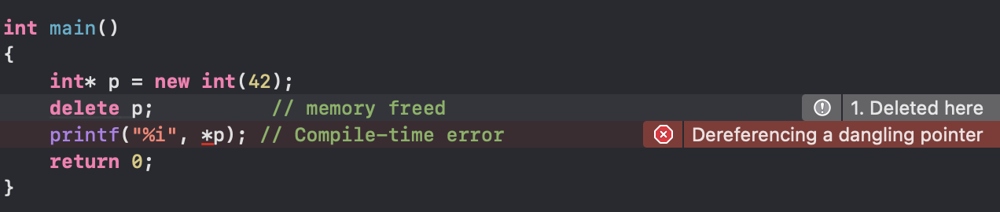

# Stainless Steel Memory Safety - What's up Danger?


# What's up Danger?

**Stainless Steel** detects a wide range of memory safety errors at compile-time.

<u>No annotation</u> required.

You get the full performance of C and C++, with a compiler that teaches you how to go *What's up Danger*, in the most powerful way possible.

(By the way *SpiderMan Into the SpiderVerse* is a great movie - made possible with **C** & **C++**)

## Stainless Memory Safety Flags

`-Wmemsafe` - **Memory Safety Inference** - Control flow graph analysis of containers and raw pointers. This is <u>on by default</u> as `-Werror=memsafe`. 

`-Wmemsafe-strict`- Stricter rules where mutable references cannot alias. 

`-Wmemsafe-off` - Turns memsafe off. 

## Memory Safety Roadmap (Experimental)

`-Wmemsafe-thread` - Compile-time Thread safety checks.

`-Wmemsafe-move` - Destructive moves.

`-Wmemsafe-opt`- Force an if-branch on optional types. No need to panic.

`-Wmemsafe-null` - Experimental check for dereferencing NULL pointers.

`-Wmemsafe-extra` - miscelaneous experimental safety features

---

Memory Safety inference is on by default in Stainless when compiling  `.cpp` files - you do not need to add any flags.

NOTE: If you want to use Memory Safety inference with plain C code, use `-std=stlc`to switch the C language dialect to Stainless C.

## Examples

Examples of code that Stainless rejects by default.

(It took a lot of effort to get these to work at scale on industrial code bases!)

## Double Delete


```cpp
int main()
{
    int* p = new int(10);
    delete p;
    delete p; // ❌ compile-time error (double free)
}
```

## Double Free


```c
#include <stdlib.h>

void cstyle()
{
    int* p = (int*)malloc(sizeof(int));
    free(p);
    free(p); // ❌ compile-time error (double free)
}
```

## Control Flow Raw Pointer Checks


```c
void for_statement_scope()
{
    int x = 0;
    int* p = &x;
    for (int i = 0; i < 1024; ++i)
    {
        *p = 123;
        int j;
        p = &j;
    }
}
```

## Use-after-free



```cpp
#include <stdio.h>

int main()
{
    int* p = new int(42);
    delete p;          // memory freed
    printf("%i", *p); // Compile-time error
    return 0;
}
```

## Container safety inference for C++ & EASTL


## Memory Safety Inference - No annotations.


## Stainless Memory Safety Inference

- **Designed for experts and beginners** - We wanted a systems language with an easy learning curve - for the beginner, intermediate, expert, & master level. Become a programming master quickly - in a language built by game developers with a speedrunner mindset.

- **Tested on real code** - Stainless Memsafe has been tested on the source code of clang, LLVM, EASTL, Raytracers, and expertly written C & C++ code. Stainless Memsafe is handwritten for how real humans code in C and C++.

- **Easy Learning Curve** - The compiler backs off and lets you experiment — you don't have to write lifetime annotations — the compiler infers memory safety. And *if* there's an error, the compiler logically explains it to you. Gain experience points without having to battle the compiler.

- **What's Up Danger** - With great power comes great responsibility. Experts don't know everything, and sometimes Computer Science theory won't hold up. There are times where you have to take a leap of faith into uncharted territory. Stainless promotes computer science education through gameplay, interactivity, humor, and direct hands-on experience. Stainless gives you the tools to go *What's up Danger*, in the most powerful way possible.

## What Stainless detects at compile time

- **Use after free** – dereferencing a [dangling pointer](https://en.wikipedia.org/wiki/Dangling_pointer "Dangling pointer") storing the address of an object that has been deleted.
- **Double free** – repeated calls to [free](https://en.wikipedia.org/wiki/Malloc "Malloc") may prematurely free a new object at the same address. If the exact address has not been reused, other corruption may occur, especially in allocators that use [free lists](https://en.wikipedia.org/wiki/Free_list "Free list").
- **[Wild pointers](https://en.wikipedia.org/wiki/Wild_pointer "Wild pointer")** arise when a pointer is used prior to initialization to some known state. They show the same erratic behaviour as dangling pointers, though they are less likely to stay undetected..

## Don't rewrite everything

With Stainless - Don't rewrite everything - Just recompile with modern tools, fix 2 or 3 lines of code, and save everyone valuable time & energy.

## Why Compile-Time Memory Safety?

Game developers need static compile-time code coverage - There might be a line of code that's only used in some special bonus level that a playtester might miss. In game development, it's a lot better to know your code will work *before* playtesting.

## Compile-Time saves Time

Movie makers have unique requirements for memory safety at compile-time. Before you do a time-consuming 3D render, you want to know your code will work *before* you wait an hour to render some frames. Having an overnight render... but coming back to a blank screen because of a segfault? That's rough buddy. Stainless memsafe is built to save you time, ahead of time.

## Catch Em All

Surprisingly, Stainless catches these errors in C, Objective C, C++, Objective C++, *and* Stainless Steel.

For stronger memory safety requirements - The Stainless build system will allow us to store metadata alongside `.o` object files, so cross-unit memory safety is possible in the future Stainless static analyzers.

With Preview 2, Stainless caught some wild pointers.

We intend to catch 'em all over time.

GOTTA CATCH 'EM ALL

***GOTTA CATCH 'EM ALL*** 

## Why was memory safety considered so hard to do for C++?

C++ is the most advanced programming language. It has the ability to do absolutely anything, including access over 25 years of applied computer science knowledge.

Stainless **Memory Safety Inference** is designed to work for the compiler developer, the game developer, the game engine architect, the scientist who just published a Manifold Dual Contouring paper, and the college freshmen taking Intro to C.

We had to study real C & C++ code, learn from real people, and write our own algorithms down on pencil & paper. It took human review and hard logic to create a natural programming language design - finely tuned for how real people code at all experience levels.

## What challenges were faced?

LLVM is pretty tough to analyze, there's Directed Acyclical Graphs that use raw pointers and call `.release` on a unique_ptr; It's pretty hard to track that it's used correctly.

`llvm/utils/TableGen/DAGISelMatcherOpt.cpp`

Another challenge was, mutable reference aliasing had be to put into a separate
 `-Wmemsafe-strict` flag, so existing C++ code bases realistically compile, and those who want stricter memory safety can enable the option per-file `#pragma memsafe strict` or compilation-wide `-Wmemsafe-strict`.

## Declaring Independence from The C++ Standards Committee

The C++ Standards Committee isn't really diving deep into C++ implementations and forming nuanced questions about how to fix specific lines of other people's code.

And frankly, C++20, 23, 26, and 29 are headed in the wrong direction. 

https://aras-p.info/blog/2018/12/28/Modern-C-Lamentations/

Stainless takes a radical view that the implementors need to be the ones making the future standard, because implementors ask deeper questions about performance and usability.

Stainless is based on C++14, with support for C++17, but we deprecate C++20,23,26, & 29, replacing it with a simpler language that is more compatible with the baremetal-style game developers & engine architects prefer.

---

With Stainless Steel, we return to asking the big questions.

How much is enough?

How much technology is enough?

When do we start focusing on kids, and encouraging the youth to become smarter than the last generation?

On a technical level, Stainless gives users Memory Safety Inference, Reflection, and a new human-centric vision for technology that is created & programmed by the masses.

On a philosophical level, Stainless is not afraid to ask the crazy questions about life, joy, and returning to the original love for humanity.

As we end the first quarter of the 21st century, Generation Z (that's me!) is starting to ask deeper philosophical questions of what is truly best for humanity.

As technology shapes our lives, we no longer subscribe to the update-death-spiral that corporations have pushed on us.

We don't need a new iPhone every year,

and we don't need a new C++ every 3 years.

## I would rather have a perfect finale to C++14 than an unfinished implementation of C++26.

   — Peach1; Some crazy college kid.
